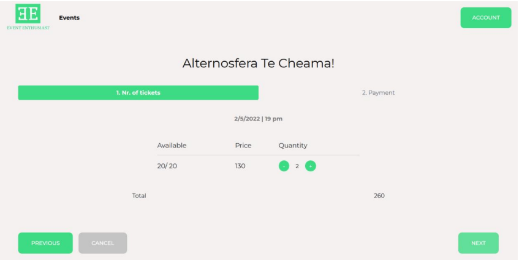
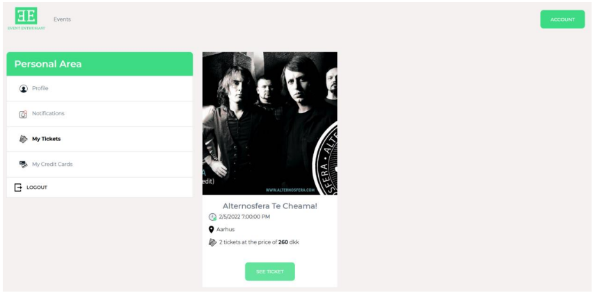

# Event Ticketing System

 [Video Presentation](https://www.youtube.com/watch?v=xnU6CIG64lc)

Event Ticketing System represents the 3rd-semester project for the Software Technology Engineering programme at VIA University College.
The goal of this project was to create a service for Event Enthusiast, a creative development center, that enables purchasing tickets to a range of live entertainment events easier and faster by establishing a single point of contact between the service provider and the customers. The aim was to develop a system that would aid customer’s existing concerns, primarily by providing a ticketing service for the events that are being hosted by the center.

* [Data tier](https://github.com/LiaCicati/event-ticket-data)
* [Logic tier](https://github.com/LiaCicati/event-tickets-logic)
